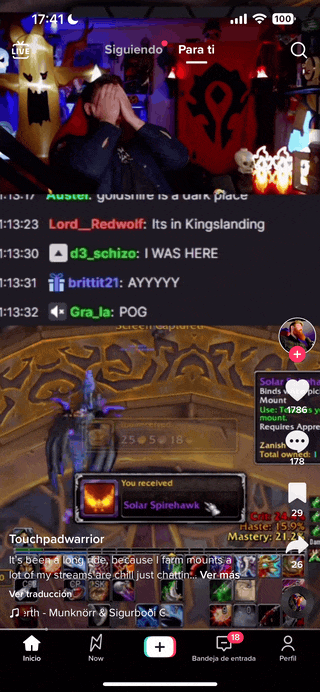

# Tiktok app

## 👁️ Objetivo

El objetivo de este ejercicio es realizar una mini app que replique la home de tiktok. Haciendo especial incapie en la forma en la que se realiza el scroll. 

Con los videos puedes inicialmente usar imágenes para posteriormente cargar videos directamente en tus assets o hacer uso de la siguiente API:
https://www.pexels.com/api/documentation

## 📝 Presta atención

Cosas a tener en cuenta para que este ejercicio llegue a buen fin:

- Crea un repo en github para trabajar con tu proyecto.
- Las llamadas tienen que hacerse de forma nativa sin librerías de por medio.
- Se valorará que añadas control de errores.
- Añade un readme explicando tu proyecto.

Aunque no debería decirlo entiendo que vas a seguir las buenas practicas que ya conoces 😈

**Develop by rudo apps**

hola@rudo.es | https://www.rudo.es
 